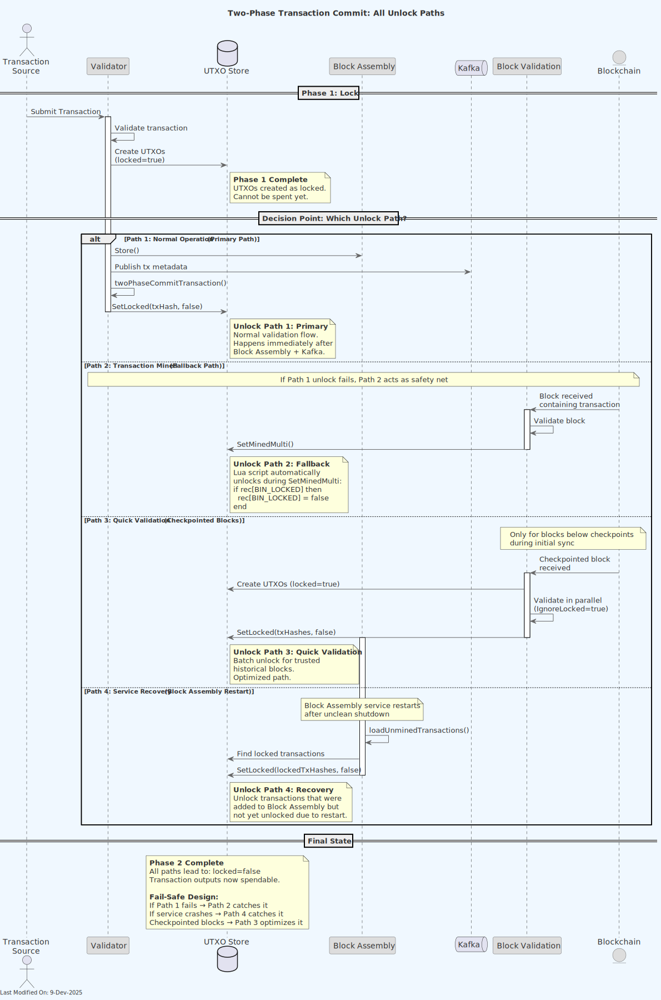
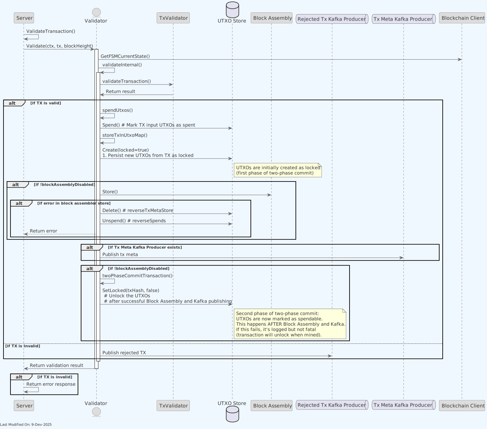
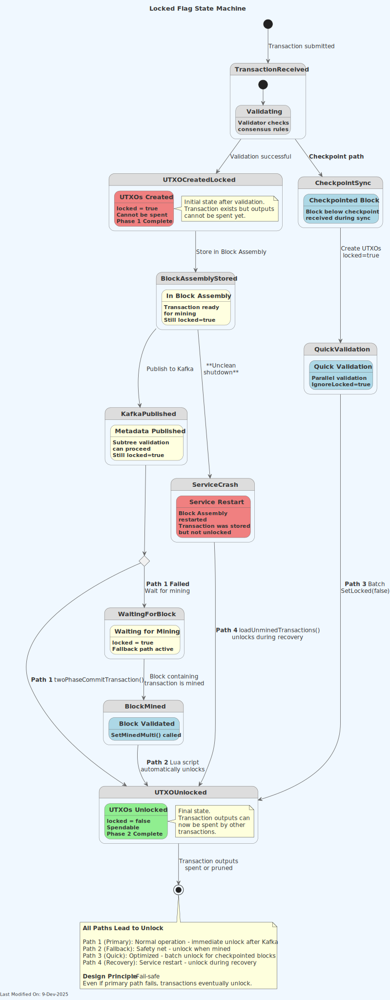
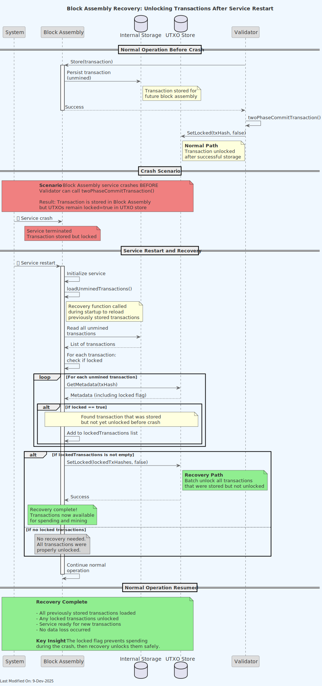

# Two-Phase Transaction Commit Process

## Index

1. [Overview](#1-overview)
2. [Purpose and Benefits](#2-purpose-and-benefits)
    - [2.1. Critical Assumptions](#21-critical-assumptions)
3. [Implementation Details](#3-implementation-details)
    - [3.1. Phase 1: Initial Transaction Creation with Locked Flag](#31-phase-1-initial-transaction-creation-with-locked-flag)
    - [3.2. Phase 2: Unsetting the Locked Flag](#32-phase-2-unsetting-the-locked-flag)
        - [3.2.1. Normal Path: After Successful Addition to Block Assembly](#321-normal-path-after-successful-addition-to-block-assembly)
        - [3.2.2. Fallback Path: When Mined in a Block](#322-fallback-path-when-mined-in-a-block)
        - [3.2.3. Quick Validation Path: Checkpointed Blocks](#323-quick-validation-path-checkpointed-blocks)
    - [3.3. Special Case: Transactions from Blocks](#33-special-case-transactions-from-blocks)
4. [Service Interaction](#4-service-interaction)
    - [4.1. Validator Service Role](#41-validator-service-role)
    - [4.2. Block Validation Service Role](#42-block-validation-service-role)
    - [4.3. Block Assembly Service Role](#43-block-assembly-service-role)
5. [Data Model Impact](#5-data-model-impact)
6. [Configuration Options](#6-configuration-options)
7. [Flow Diagrams](#7-flow-diagrams)
8. [Related Documentation](#8-related-documentation)

## 1. Overview

The Two-Phase Transaction Commit process is a mechanism implemented in Teranode to ensure atomicity and data consistency during transaction processing across the system's microservice architecture. This process uses a "locked" flag to temporarily lock transaction outputs until they are safely included in Block Assembly, and then makes them available for spending after confirmation.

When a Bitcoin transaction is processed, it both spends existing outputs (inputs) and creates new outputs that can be spent in the future. In Teranode's distributed architecture, transaction processing spans multiple services - particularly the UTXO store (where transaction data is persisted) and Block Assembly (where transactions are prepared for inclusion in blocks). The two-phase commit process ensures atomicity across these services, preventing scenarios where a transaction might exist in one component but not another.

This approach ensures transaction consistency across the entire system, preventing situations where a transaction might be included in a block but not properly recorded in the UTXO store, or vice versa. It maintains system integrity in a distributed environment by coordinating state changes across microservices.

## 2. Purpose and Benefits

The Two-Phase Transaction Commit process addresses several critical concerns that arise in a distributed transaction processing system:

- **Atomicity in a Microservice Architecture**: The process ensures that a transaction is either fully processed across all components or effectively doesn't exist at all. This prevents serious inconsistencies between the UTXO store and Block Assembly.

- **Prevention of Data Corruption Scenarios**:

    - **Scenario 1 - Block Assembly Without UTXO Storage**: Without two-phase commit, if a transaction were added to Block Assembly but failed to be stored in the UTXO store, when that block is mined, future transactions trying to spend its outputs would be rejected because the outputs don't exist in the UTXO store. This could cause a chain fork.
    - **Scenario 2 - UTXO Storage Without Block Assembly**: If a transaction is stored in the UTXO store but not added to Block Assembly, it creates "ghost money" that exists in the database but isn't in the blockchain.

- **Safe Failure Mode**: In case of system failures, the worst case is that money temporarily can't be spent (rather than creating invalid money or losing funds). This preserves the integrity of the monetary system.

- **System Consistency**: Ensures that the UTXO database state and Block Assembly state are synchronized, maintaining a consistent view of transactions across the system.

- **Transaction Dependency Management**: Ensures proper handling of transaction dependencies in a distributed processing environment.

- **Improved Validation**: Provides a clear state transition mechanism that helps track the status of transactions throughout the system.

### 2.1. Critical Assumptions

The Two-Phase Transaction Commit process is built on a critical assumption that must be understood to grasp how the system prevents double-spending and maintains consistency:

> **Critical Assumption**: Parent transactions are either mined, in block template, or in previous block. No other option is possible.

This means that for any transaction being processed,  **all input transactions (parent transactions) must be in one of these states**:

    - Already mined in a confirmed block (transactions in blocks with multiple confirmations)
    - Currently in a block template (pending mining, not yet in a block)
    - In the immediately previous block (transactions in the most recently mined block)

> **Note**: The distinction between "already mined in a confirmed block" and "in the immediately previous block" is important. The former refers to transactions with multiple confirmations that are considered stable, while the latter refers specifically to transactions in the most recently added block that have only one confirmation and may still be subject to reorganization.

**Implications**:

    - This assumption ensures that all parent transactions are either confirmed or in the process of being confirmed
    - It prevents the system from processing transactions that refer to parent transactions that are still in an intermediate state
    - It creates a clean dependency chain where transactions build upon others that are already securely in the system

**Security Benefits**:

    - Prevents transaction graph inconsistencies
    - Eliminates scenarios where transaction outputs could be spent before their parent transactions are fully committed
    - Supports the effectiveness of the locked flag mechanism

This assumption is foundational to the system's security model and crucial for the proper functioning of the two-phase commit process.

## 3. Implementation Details

### 3.1. Phase 1: Initial Transaction Creation with Locked Flag

When a transaction is validated and accepted by the system:

1. The Validator service processes and validates the transaction according to Bitcoin SV consensus rules.

2. Upon successful validation, new UTXOs generated by the transaction are created in the UTXO store with the "locked" flag set to `true`.

3. This flag prevents these UTXOs from being spent in subsequent transactions while they're still being processed through the system.

4. The transaction is marked as valid and forwarded to Block Assembly for inclusion in a block.

### 3.2. Phase 2: Unsetting the Locked Flag

The locked flag is unset in two key scenarios:

#### 3.2.1. Normal Path: After Successful Addition to Block Assembly

This is the primary unlock mechanism that occurs during normal transaction processing:

1. Transaction is successfully validated by the Validator service
2. UTXOs are created in the UTXO store with `locked=true`
3. Transaction is sent to Block Assembly via the `Store()` method
4. Transaction metadata is published to the Kafka topic for subtree validation
5. The Validator service calls `twoPhaseCommitTransaction()` which executes `SetLocked(txHash, false)` on the UTXO store
6. The locked flag is now `false`, making the transaction outputs available for spending

**Important Notes:**

- The unlock happens AFTER successful Block Assembly addition and Kafka publishing, not immediately after
- This is implemented in the `Validator.twoPhaseCommitTransaction()` function in `services/validator/Validator.go`
- If this step fails, it's logged but not considered fatal since the transaction will be unlocked when mined (fallback mechanism)
- Once unlocked, transaction outputs can be spent even before the transaction is mined in a block

#### 3.2.2. Fallback Path: When Mined in a Block

This is a safety mechanism that ensures the locked flag is eventually unset even if the normal path fails:

1. When a block containing the transaction is validated, the Block Validation service processes the block and identifies all transactions within it

2. As part of the `SetMinedMulti` operation during block processing, the service updates transaction metadata in the UTXO store

3. The Lua script in `stores/utxo/aerospike/teranode.lua` automatically unsets the locked flag (changes it to `false`) if it hasn't been unset already:

    ```lua
    -- set the record to not be locked again, if it was locked, since if was just mined into a block
    if rec[BIN_LOCKED] then
        rec[BIN_LOCKED] = false
    end
    ```

4. The transaction is now fully committed and integrated into the blockchain

**Purpose**: This fallback ensures that even if the normal unlock path (3.2.1) fails for any reason, transactions will still be unlocked when they're mined in a block. This maintains system consistency and prevents permanently locked transactions.

#### 3.2.3. Quick Validation Path: Checkpointed Blocks

For blocks below checkpoints (trusted historical blocks), a specialized validation path is used:

1. Block Validation service identifies the block is below a checkpoint

2. UTXOs are created for all transactions in the block with `locked=true` (via `createAllUTXOs()`)

3. All transactions are spent/validated in parallel (via `spendAllTransactions()` with `IgnoreLocked: true`)

4. Block is added to the blockchain with `MinedSet=true`

5. The Block Validation service calls `SetLocked(txHashes, false)` to unlock all transaction outputs at once

**Key Differences from Normal Path:**

- UTXOs are created BEFORE validation (trusted checkpoint assumption)
- All transactions unlocked together in batch operation
- Direct call to `SetLocked()` instead of going through `twoPhaseCommitTransaction()`
- Implemented in `Block Validation.quickValidateBlock()` in `services/blockvalidation/quick_validate.go`

**When Used**: Only for blocks below checkpoints during initial blockchain synchronization or when catching up from far behind

### 3.3. Special Case: Transactions from Blocks

For transactions that are received as part of a block (rather than through the transaction validation process):

1. The Validator can be configured to ignore the locked flag when validating transactions that are part of a received block.

2. This is controlled via the `WithIgnoreLocked` option in the Validator service.

3. This approach allows the system to accept transactions that are already part of a valid block, even if they would spend outputs that are marked as locked in the local UTXO store.

4. This mechanism is essential for handling block synchronization and reorgs properly.

## 4. Service Interaction

### 4.1. Validator Service Role

The Validator service is responsible for:

- **Phase 1 (Lock)**: Validating incoming transactions against consensus rules and creating UTXOs with `locked=true` in the UTXO store
- **Transaction Forwarding**: Sending validated transactions to Block Assembly via the `Store()` method and publishing transaction metadata to Kafka
- **Phase 2 (Unlock)**: Calling `twoPhaseCommitTransaction()` to unset the locked flag after successful Block Assembly addition and Kafka publishing
- **Error Handling**: Logging but not treating unlock failures as fatal, since the fallback mechanism (SetMinedMulti) will unlock the transaction when mined
- **Special Case**: Ignoring the locked flag when validating transactions that are already part of a received block (controlled via `WithIgnoreLocked` option)

The Validator orchestrates the complete two-phase commit flow for transactions entering the system through the validation pipeline. See `services/validator/Validator.go` for implementation details.

### 4.2. Block Validation Service Role

The Block Validation service plays a critical role in the fallback unlock mechanism and has two distinct paths for unlocking transactions:

**Normal Block Processing (Fallback Path):**

- Validates blocks and their transactions against consensus rules
- Calls `SetMinedMulti()` to mark transactions as mined in a block
- The `SetMinedMulti` operation triggers a Lua script (`stores/utxo/aerospike/teranode.lua`) that automatically unsets the locked flag if it was still set
- This provides the safety net that ensures transactions are eventually unlocked even if the Validator's unlock step failed
- Implemented in `services/blockvalidation/` using the UTXO store's batch operations

**Quick Validation Path (Checkpointed Blocks):**

- Identifies blocks below checkpoints (trusted historical blocks)
- Creates all UTXOs with `locked=true` before validation (trusted checkpoint assumption)
- Validates all transactions in parallel with `IgnoreLocked: true`
- Directly calls `SetLocked(txHashes, false)` to unlock all transactions in a single batch operation
- Implemented in `BlockValidation.quickValidateBlock()` in `services/blockvalidation/quick_validate.go`

The Block Validation service ensures that the second phase of the commit process is always completed, either through the Lua script during normal processing or through direct unlock during quick validation.

### 4.3. Block Assembly Service Role

The Block Assembly service participates in the two-phase commit process in two ways:

**Normal Operation:**

- Receives validated transactions from the Validator service via the `Store()` method
- Stores transactions in its internal data structures for block template assembly
- Transactions remain locked during this process until the Validator completes the unlock via `twoPhaseCommitTransaction()`
- Does not directly interact with the locked flag during normal transaction acceptance

**Recovery/Startup Path:**

- During service startup or recovery, Block Assembly loads previously stored unmined transactions via `loadUnminedTransactions()`
- Identifies transactions that are still marked as `locked=true` in the UTXO store
- Calls `SetLocked(lockedTxHashes, false)` to unlock these transactions, as they were successfully added to Block Assembly in a previous run
- This ensures transactions don't remain permanently locked if the Validator's unlock step was interrupted by a service restart
- Implemented in `BlockAssembler.loadUnminedTransactions()` in `services/blockassembly/BlockAssembler.go`

The Block Assembly service acts as an additional safety mechanism that unlocks transactions during recovery scenarios, complementing the Validator's normal unlock path and the Block Validation fallback path.

## 5. Data Model Impact

The Two-Phase Transaction Commit process impacts the UTXO data model by using the "locked" flag field in the UTXO records. This flag is stored in the UTXO metadata and is used to track the state of transaction outputs throughout the system.

For complete details on the UTXO data model, including all fields and their descriptions, please refer to the [UTXO Data Model Documentation](../datamodel/utxo_data_model.md).

**Locked Flag Field:**

| Field Name | Type    | Description                                             |
|------------|---------|---------------------------------------------------------|
| locked     | boolean | Indicates if the UTXO is temporarily locked during two-phase commit |

This field is part of the UTXO record and is set to `true` when a transaction is initially created, then set to `false` after successful addition to Block Assembly or when the transaction is mined in a block.

## 6. Configuration Options

The behavior of the Two-Phase Transaction Commit process can be configured through the following options:

**Validator Service:**

```text
WithIgnoreLocked(bool) - When set to true, the validator will ignore the locked flag when processing transactions that are part of a block
```

In the Validator Options struct:

```go
type Options struct {
    IgnoreLocked bool
}
```

## 7. Flow Diagrams

The following diagrams illustrate the two-phase commit process from different perspectives. Together, they provide a complete view of how transactions move through the system from validation to final commitment.

### 7.1. Two-Phase Commit Overview

This diagram shows the complete flow of the two-phase commit process from a high level:



**Key Elements:**

- Initial transaction validation and UTXO creation with `locked=true`
- All four unlock paths (Primary, Fallback, Quick Validation, Recovery)
- Decision points that determine which unlock path is taken
- Interactions between Validator, Block Assembly, and Block Validation services
- Fail-safe design showing how paths complement each other

### 7.2. Transaction Validation Flow (Primary Path)

This diagram shows the detailed flow of transaction validation and the normal unlock path:



**Key Steps Shown:**

- Transaction validation by Validator service
- UTXO creation with `locked=true`
- Forwarding to Block Assembly via `Store()`
- Publishing to Kafka for subtree validation
- Unlock via `twoPhaseCommitTransaction()` → `SetLocked(false)`

**Important**: The diagram shows the timing of when the locked flag is unset - AFTER both Block Assembly storage and Kafka publishing complete successfully.

### 7.3. Locked Flag State Machine

This diagram illustrates the locked flag's complete lifecycle as a state machine:



**State Transitions Shown:**

- Initial state: UTXO created with `locked=true`
- Transition conditions for each of the four unlock paths
- Final state: `locked=false` (spendable)
- Error states and recovery paths
- Service crash scenarios and recovery mechanisms

### 7.4. Block Validation and Mining (Fallback Path)

This diagram shows how transactions are marked as mined and automatically unlocked as a fallback mechanism:


**Key Steps Shown:**

- Block validation process
- `SetMinedMulti()` operation
- Lua script automatic unlock (fallback mechanism)
- Transaction metadata updates

**Purpose**: This path serves as the safety net that ensures transactions are eventually unlocked even if the primary unlock path (7.2) fails.

### 7.5. Block Assembly Recovery Flow

This diagram shows the detailed recovery process that occurs during Block Assembly service startup:



**Recovery Steps Shown:**

- Normal operation before crash (transaction stored, unlock pending)
- Crash scenario (service terminated before unlock)
- Service restart and initialization
- Loading unmined transactions from storage
- Identifying transactions with `locked=true`
- Batch unlock operation via `SetLocked(lockedTxHashes, false)`
- Restoring normal operation state

**Purpose**: Demonstrates how the system recovers gracefully from service restarts or crashes, ensuring transactions don't remain locked indefinitely. This is the fourth unlock path that complements the other three.

## 8. Related Documentation

- [Validator Service Documentation](../services/validator.md#271-two-phase-transaction-commit-process)
- [Block Validation Service Documentation](../services/blockValidation.md#23-marking-txs-as-mined)
- [UTXO Data Model Documentation](../datamodel/utxo_data_model.md)
